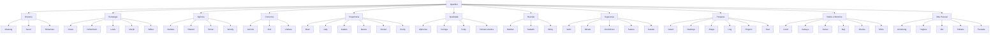

# Organização

```mermaid
flowchart TD
  root["OpenBot"]
  root --> s0["Diretoria"]
  s0 --> a32["Mustang"]
  s0 --> a41["Sasori"]
  s0 --> a46["Shikamaru"]
  root --> s1["Estratégia"]
  s1 --> a10["Grace"]
  s1 --> a14["Hohenheim"]
  s1 --> a27["Lewis"]
  s1 --> a31["Murph"]
  s1 --> a51["Wilbur"]
  root --> s2["Agência"]
  s2 --> a6["Deidara"]
  s2 --> a7["Edward"]
  s2 --> a48["Temari"]
  s2 --> a53["Woody"]
  root --> s3["Comercial"]
  s3 --> a21["Juninho"]
  s3 --> a35["Nick"]
  s3 --> a50["Urahara"]
  root --> s4["Engenharia"]
  s4 --> a4["Buzz"]
  s4 --> a20["Judy"]
  s4 --> a22["Kabuto"]
  s4 --> a33["Naruto"]
  s4 --> a38["Rocket"]
  s4 --> a39["Rocky"]
  root --> s5["Qualidade"]
  s5 --> a0["Alphonse"]
  s5 --> a5["Coringa"]
  s5 --> a9["Forky"]
  s5 --> a15["Homem-Aranha"]
  root --> s6["Revisão"]
  s6 --> a2["Batman"]
  s6 --> a23["Kakashi"]
  s6 --> a52["Winry"]
  root --> s7["Segurança"]
  s7 --> a18["Itachi"]
  s7 --> a30["Minato"]
  s7 --> a36["Orochimaru"]
  s7 --> a40["Sakura"]
  s7 --> a42["Sasuke"]
  root --> s8["Pesquisa"]
  s8 --> a11["Greed"]
  s8 --> a13["Hawkeye"]
  s8 --> a19["Jiraiya"]
  s8 --> a28["Ling"]
  s8 --> a37["Pinguim"]
  s8 --> a43["Scar"]
  root --> s9["Dados e Memória"]
  s9 --> a12["Groot"]
  s9 --> a24["Katsuyu"]
  s9 --> a26["Konan"]
  s9 --> a34["Neji"]
  s9 --> a44["Sheska"]
  s9 --> a47["Shino"]
  root --> s10["Vida Pessoal"]
  s10 --> a1["Armstrong"]
  s10 --> a16["Hughes"]
  s10 --> a29["Mei"]
  s10 --> a45["Shikaku"]
  s10 --> a49["Tsunade"]
```
